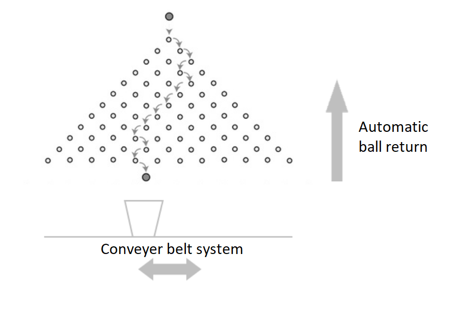
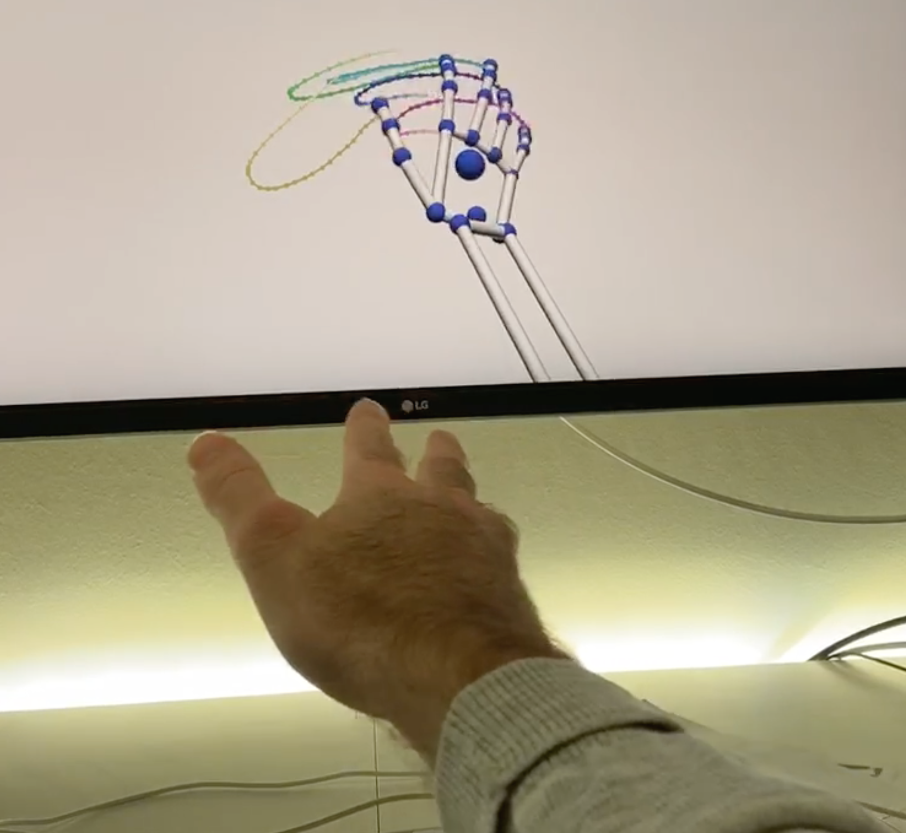

# Robotics
2019-2020 Robotics projects 

We propose a simple game where players have to catch a falling ball by moving a cup using hand gestures. As seen in the image below a ball is dropped at the top of a bean machine and the player has to react to the random movements of the ball. Sensory data from the [Ultraleap](https://www.ultraleap.com/) (formally Leap Motion) will drive a conveyor belt or a single axis slider on which the cup is placed. Once implemented this idea can easily be extended to encompass more sophisticated challenges, i.e. object detection.

Minimal idea           |  Data gathered by Ultraleap sensor
:-------------------------:|:-------------------------:
 | 

# Possible Extensions

## Automated ball returns

Build an elevator which returns the ball to the top automatically, if the player didn’t catch it.

## Object detection using OpenCV

Introduce score variation depended on ball color. The color of the ball is gathered through OpenCV. Missing the goal deducts points and returns the ball to try again until all balls have been collected.

## Automated ball catches

Once object detection is implemented the computer will also be able to play and set a score. Human players can try to beat the computer.

## Cocktail Extravaganza

A more elaborate extension of the basic Pachinko idea would be to create a cocktail robot. You can mix cocktails by moving the cup under liquor dispensers. Squeeze your fist to release alcohol, the robot checks (distance sensor or camera) if the cup is actually position correctly in order to avoid spillage.

# Materials

| Amount | Material         |
| :----- | :--------------- |
| 1x     | Raspberry Pi     |
| 1x     | Ultraleap sensor |
| 1x     | Slider           |
| 1x     | Cup              |
| 1x     | Bean machine     |
| 3x     | Balls            |